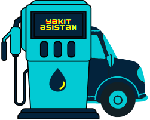
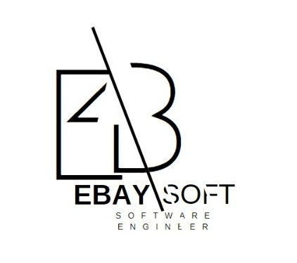

# ***Yakit Asisstant API***

<section class="section header">
    

      <h1 class="title">
         Yakıt Asistan
      </h1>
      

        <strong>Yakıt Asistan</strong> uygulamasına hoşgeldin!!
      

    

</section>

<section class="section" id="main-content">
    
  

    

      

          <Strong>Documentation</Strong> - Overview 

      

    

    

      
 <strong>What is "Fuel Assistant"</strong>

      
&nbsp&nbsp The "Fuel Assistant" application, developed by Ebaysoft Software Development, provider users with fuel price data from fuel companies across Turkey. Built with NodeJS technologies for the web, it offers comprehensive features on both Android and iOS platforms, such as online and offline vehicle lists, average consumption tracking, travel expenses, and detailed fuel calculations and history. Additionally, the application lists fuel prices by city for various fuel companies.

        
      
 <strong>API Features</strong>

      
&nbsp&nbsp Server URL : <strong><%=server_url %></strong>

      

        <ul>
          <li>Authentication Services</li>
          <li>Key and Billing Services</li>
          <li>Fuel Costs</li>
          <li>City Lists</li>
        </ul>
      

        
      
 <strong>Mobile App Features</strong>

      
&nbsp&nbsp Mobile APP URL : Application will be on <strong>Google Play</strong> and <strong>Appstore</strong> very soon.

      

        <ul>
          <li>Authentication Services</li>
          <li>Online Access</li>
          <li>Offline Access</li>
          <li>Profile Services</li>
          <li>Car İnformation Services</li>
          <li>Fuel Costs Services</li>
          <li>Calculation Services</li>
        </ul>
      

        
      
 <strong>URLs of properties</strong>:

      
&nbsp&nbsp The services and features that the api offers

      

        <ul>
          <li>/login - You can access the apikey information by logging in.</li>
          <li>/register - You can create an apikey as a member.</li>
          <li>/po - Fuel prices of the PO company.</li>
          <li>/aytemiz - Fuel prices of the AYTEMİZ company.</li>
          <li>/opet - Fuel prices of the OPET company.</li>
          <li>/shell - Fuel prices of the SHELL company.</li>
          <li>/go - Fuel prices of the GO company.</li>
          <li>/moil - Fuel prices of the MOİL company.</li>
          <li>/tp - Fuel prices of the TP company.</li>
          <li>/soil - Fuel prices of the SOİL company.</li>
          <li>/city-list - Cities served by fuel companies..</li>
        </ul>
      

        
      
 <strong>Fuel Companies</strong>

      
&nbsp&nbsp These are the estimated prices for these companies. It is definitely not intended for <strong>Commercial</strong> and <strong>Advertising</strong> purposes!

      

        <ul>
          <li> &nbsp&nbsp-&nbsp&nbsp SHELL</li>
          <li> &nbsp&nbsp-&nbsp&nbsp OPET</li>
          <li> &nbsp&nbsp-&nbsp&nbsp PO</li>
          <li> &nbsp&nbsp-&nbsp&nbsp TP</li>
          <li> &nbsp&nbsp-&nbsp&nbsp SOİL</li>
          <li> &nbsp&nbsp-&nbsp&nbsp GO</li>
          <li> &nbsp&nbsp-&nbsp&nbsp AYTEMİZ</li>
          <li> &nbsp&nbsp-&nbsp&nbsp MOİL</li>
        </ul>
      

        
      
 <strong>Contact US</strong>:

      

        <dl>
          <dt>&nbsp&nbsp&nbsp Gmail</dt>
            <dd>
              <a href="mailto:enesbayri1@gmail.com">enesbayri1@gmail.com</a>
            </dd>
             
          <dt>&nbsp&nbsp&nbsp Linkedln</dt>
            <dd>
              <a href="https://www.linkedin.com/in/enes-bayri-8121282a3/">https://www.linkedin.com/in/enes-bayri-8121282a3/</a>
            </dd>
             
          <dt>&nbsp&nbsp&nbsp Github</dt>
            <dd>
              <a href="https://github.com/enesbayri">https://github.com/enesbayri</a>
            </dd>
             
        </dl>
      

        
      
 <strong>Privacy and Copyright Notice</strong>

      
&nbsp&nbsp Fuel Assistant application, developed by Ebaysoft Software Development, respects your privacy. We collect and use data solely to enhance your experience and improve our services. All content, including data, design, and functionality, is the intellectual property of Ebaysoft Software Development and is protected by copyright laws. Unauthorized use or distribution of the application's content is strictly prohibited.

       
</section>
 
 
 
<section class="section header">

<h1>USAGE</h1>
</section>
<section class="section" id="main-content">
      
    

      

        

            <Strong>Documentation</Strong> - Usage 

        

      

      

        
 <strong>URLs of properties</strong>:

        

          <dl>
            <dt>&nbsp&nbsp&nbsp Membership and creating an APIKEY</dt>
              <dd>
                <ol type="I">
                  <li> Sign up from the "/register" page.</li>
                  <li> Your APIKEY will be generated automatically. You can access the data with your API.</li>
                  <li> If you are a member, log in from the "/ login" page and copy your APIKEY.</li>
                </ol>
              </dd>
               
            <dt>&nbsp&nbsp&nbsp Services Usage</dt>
              <dd>
                <ol type="I">
                  <li> You can access the services with your APIKEY.</li>
                </ol>
              </dd>
               
            <dt>&nbsp&nbsp&nbsp Billing and Right of Use</dt>
              <dd>
                <ol type="I">
                  <li> Every time you send a request to the API, your right to use it will be reduced.</li>
                  <li> You will not be able to access the data when your right to use it expires. You can log in and request the right of use from your homepage.</li>
                </ol>
              </dd>
               
          </dl>
        

          
        
 <strong>Get your APIKEY</strong>:

        <button class="button is-info">Get APIKEY</button>
           
        
 <strong>URLs of properties</strong>:

        

          <ul>
            <li>/login</li>
            <li>/register</li>
            <li>/po</li>
            <li>/aytemiz</li>
            <li>/opet</li>
            <li>/shell</li>
            <li>/go</li>
            <li>/moil</li>
            <li>/tp</li>
            <li>/soil</li>
            <li>/city-list</li>
          </ul>
        

          
        
 <strong>API request prototype</strong>:

        <pre><code class="language-javascript" id="apikey">curl -X GET <%=server_url %>company-name?apikey=YOURAPİKEY -H "Content-Type: application/json" 
        </code></pre>
         
        
 API Usage : <strong>Node</strong>

        <pre><code class="language-javascript" id="apikey">
            var http = require("https");
            var options = {
            "method": "GET",
            "hostname": "server-url",
            "port": null,
            "path": "/po?apikey=YOURAPIKEY",
            "headers": {
                "content-type": "application/json",
            }
            };
            var req = http.request(options, function (res) {
            var costs = [];
            res.on("data", function (cost) {
                costs.push(cost);
            });
            res.on("end", function () {
                var body = Buffer.concat(costs);
                console.log(body.toString());
            });
            });
            req.end();
        </code></pre>
         
        
 API Usage : <strong>Javascript</strong>

        <pre><code class="language-javascript" id="apikey">
            var data = null;
            var xhr = new XMLHttpRequest();
            xhr.withCredentials = true;
            xhr.addEventListener("readystatechange", function () {
            if (this.readyState === this.DONE) {
                console.log(this.responseText);
            }
            });
            xhr.open("GET", "serverUrl/po?apikey=YOURAPIKEY");
            xhr.setRequestHeader("content-type", "application/json");
            xhr.send(data);
        </code></pre>
         
        

    

    
  </section>
  
 
 
 
<section class="section header">

<h1>Response</h1>
</section>
<section class="section" id="main-content">
      
    

      

        

            <Strong>Documentation</Strong> - Response 

        

      

      

      
 API Response: <strong>200 - ok</strong>

      <pre><code class="language-javascript" id="apikey">
        {
          "PO": {
          "istanbulavrupa": [
          "40.29",
          "40.67",
          "40.67",
          "20.19"
          ],
          "istanbul": [
          "40.15",
          "40.57",
          "40.57",
          "19.64"
          ],
          "ankara": [
          "41.24",
          "41.63",
          "41.63",
          "20.19"
          ],
          ...
          }
        }  
      </code></pre>
        
      
<strong>Errors</strong>

      
 API Response: <strong>406 - APIKEY required</strong>

      <pre><code class="language-javascript" id="apikey">{
        "app": "Yakit Asistan",
        "code": "406",
        "error": "APIKEY required",
        "msg": "Create a request with your Apikey. Your request format should be like this: '<%=server_url%>/po?apikey=YourApiKey'."
        }
      </code></pre>
       
      
 API Response: <strong>401 - invalid APIKEY</strong>

      <pre><code class="language-javascript" id="apikey">{
        "app": "Yakit Asistan",
        "code": "401",
        "error": "invalid APIKEY",
        "msg": "Your Apikey could not be verified.Please check your Apikey!'."
        }
      </code></pre>
       
      
 API Response: <strong>401 - invalid credential</strong>

      <pre><code class="language-javascript" id="apikey">{
        "app": "Yakit Asistan",
        "code": "401",
        "error": "invalid credential",
        "msg": "Your credential could not be verified.Please check your membership! <%=server_url%>register"
        }
      </code></pre>
       
      
 API Response: <strong>402 - required payment</strong>

      <pre><code class="language-javascript" id="apikey">{
        "app": "Yakit Asistan",
        "code": "402",
        "error": "required payment",
        "msg": "Your Apikey request limit has expired. Please check your request and payment plan."
        }
      </code></pre>
       
      

    
  </section>
  
